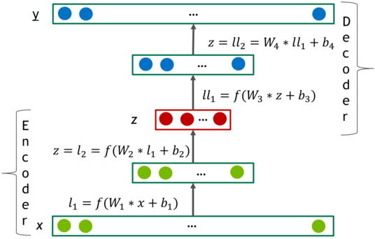

# Deep AutoEncoders for Collaborative Filtering
This work was done at NVIDIA.

### The model
The model is based on deep AutoEncoders. See paper for details.



## Requirements
* Python 3.6 (I recommend Anaconda)
* [Pytorch](http://pytorch.org/)
* CUDA (recommended version is 8.0)

## Getting Started

### Run unittests first
The code is intended to run on GPU. Last test can take a minute or two.
```
$ python -m unittest test/data_layer_tests.py
$ python -m unittest test/test_model.py
```

### Get the data

[Netflix prize](http://netflixprize.com/)

* ```$ mkdir -p ~/Recommendations``` you can use any other folder name
* Download from [here](http://academictorrents.com/details/9b13183dc4d60676b773c9e2cd6de5e5542cee9a) to ```~/Recommendations```
* ```$ cd ~/Recommendations```
* ```$ tar -xvf nf_prize_dataset.tar.gz```
* ```$ tar -xf download/training_set.tar ```
* Create necessary folders
```
mkdir -p Netflix/N3M_TRAIN
mkdir -p Netflix/N3M_VALID
mkdir -p Netflix/N3M_TEST
mkdir -p Netflix/N6M_TRAIN
mkdir -p Netflix/N6M_VALID
mkdir -p Netflix/N6M_TEST
mkdir -p Netflix/N1Y_TRAIN
mkdir -p Netflix/N1Y_VALID
mkdir -p Netflix/N1Y_TEST
mkdir -p Netflix/NF_TRAIN
mkdir -p Netflix/NF_VALID
mkdir -p Netflix/NF_TEST
```
* ```$ python ~/repos/DeepRecoEncoders/data_utils/netflix_data_convert.py training_set Netflix```. Here ```~/repos/DeepRecoEncoders''' is a path to this repo.

### Train the model
In this example, the model will be trained for 12 epochs. In paper we train for 102.
```
python ~/repos/DeepRecoEncoders/run.py --gpu_ids 0 \
--path_to_train_data Netflix/NF_TRAIN \
--path_to_eval_data Netflix/NF_VALID \
--hidden_layers 512,512,1024 \
--non_linearity_type selu \
--batch_size 128 \
--logdir model_save \
--drop_prob 0.8 \
--optimizer momentum \
--lr 0.005 \
--weight_decay 0 \
--aug_step 1 \
--noise_prob 0 \
--num_epochs 12 \
--summary_frequency 1000
```

Note that you can run Tensorboard in parallel
```
$ tensorboard --logdir=model_save
```

### Run inference on the Test set
```
python ~/repos/DeepRecoEncoders/infer.py \
--path_to_train_data Netflix/NF_TRAIN \
--path_to_eval_data Netflix/NF_TEST \
--hidden_layers 512,512,1024 \
--non_linearity_type selu \
--save_path model_save/model.epoch_11 \
--drop_prob 0.8 \
--predictions_path preds.txt
```

### Compute Test RMSE
```
python ~/repos/DeepRecoEncoders/compute_RMSE.py --path_to_predictions=preds.txt
```
After 12 epochs you should get RMSE around 0.927. Train longer to get below 0.92